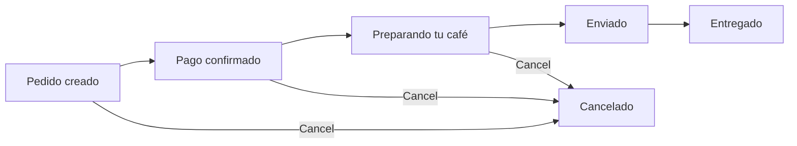

The `Order` model captures a complete purchase transaction. It stores the total payment amount, a reference to the payment gateway transaction, a snapshot of the delivery address, and a JSON array of the purchased products with quantities. Orders are linked to a registered user and progress through a defined lifecycle from creation to delivery.

Orders do **not** use the draft/publish workflow — every saved order record is immediately live.

## Fields

| Field | Type | Required | Description |
|---|---|---|---|
| `id` | integer | — | Auto-generated unique identifier |
| `totalPayment` | decimal | Yes | Total amount charged, including any discounts and shipping |
| `idPayment` | string | No | Payment gateway transaction reference (e.g., Stripe payment intent ID) |
| `addressShiping` | json | Yes | Snapshot of the delivery address at the time of order |
| `products` | json | Yes | Array of product objects with quantities |
| `user` | relation → User | No | The authenticated user who placed the order |
| `state` | enumeration | No | Current order status. See lifecycle below |

## Relationships

| Relation | Type | Target model | Description |
|---|---|---|---|
| `user` | One-to-one | users-permissions.user | The customer who placed the order |

## Order state lifecycle

The `state` field moves through the following stages. Cancellation is possible at any point before delivery.



| State | Meaning |
|---|---|
| `Pedido creado` | Order has been created; awaiting payment confirmation |
| `Pago confirmado` | Payment was successfully processed |
| `Preparando tu café` | Order is being prepared by the café |
| `Enviado` | Order has been handed off to the carrier |
| `Entregado` | Order was delivered to the customer |
| `Cancelado` | Order was cancelled before delivery |

## The `products` JSON field

The `products` field is a JSON array. Each element represents one line item in the order: the full product data at the time of purchase plus the quantity ordered. Storing a snapshot — rather than a live relation — ensures order history remains accurate even if products are later modified or deleted.

<ResponseField name="products" type="array">
  Array of purchased product line items.

  <Expandable title="item properties">
    <ResponseField name="id" type="integer">
      The product's ID at the time of the order.
    </ResponseField>
    <ResponseField name="title" type="string">
      Product title at the time of the order.
    </ResponseField>
    <ResponseField name="price" type="integer">
      Unit price in the smallest currency unit at the time of the order.
    </ResponseField>
    <ResponseField name="discount" type="integer">
      Discount percentage applied at the time of the order.
    </ResponseField>
    <ResponseField name="quantity" type="integer">
      Number of units purchased.
    </ResponseField>
    <ResponseField name="slug" type="string">
      Product slug at the time of the order.
    </ResponseField>
    <ResponseField name="cover" type="string">
      URL of the product cover image at the time of the order.
    </ResponseField>
  </Expandable>
</ResponseField>

## The `addressShiping` JSON field

<Note>
  Note the field name is spelled `addressShiping` (single `p`) in the schema — match this exactly in API requests.
</Note>

The `addressShiping` field is a JSON snapshot of the delivery address captured when the order is placed. This ensures the shipping destination is preserved even if the user later edits or deletes their address book entry.

<ResponseField name="addressShiping" type="object">
  Snapshot of the delivery address.

  <Expandable title="properties">
    <ResponseField name="title" type="string">
      Address label (e.g., "Home", "Office").
    </ResponseField>
    <ResponseField name="name" type="string">
      Full name of the recipient.
    </ResponseField>
    <ResponseField name="address" type="string">
      Street address line.
    </ResponseField>
    <ResponseField name="city" type="string">
      City name.
    </ResponseField>
    <ResponseField name="state" type="string">
      State or province.
    </ResponseField>
    <ResponseField name="postalCode" type="string">
      Postal or ZIP code.
    </ResponseField>
    <ResponseField name="phone" type="string">
      Contact phone number, excluding dial code.
    </ResponseField>
    <ResponseField name="dialCode" type="string">
      International dial code (e.g., `"+34"`).
    </ResponseField>
  </Expandable>
</ResponseField>

## API response example

```json
{
  "data": {
    "id": 208,
    "attributes": {
      "totalPayment": 36.15,
      "idPayment": "pi_3QKdX2LkZbF7GhYU0j4mNpRv",
      "state": "Preparando tu café",
      "createdAt": "2025-12-04T16:42:00.000Z",
      "updatedAt": "2025-12-04T17:05:00.000Z",
      "addressShiping": {
        "title": "Home",
        "name": "María García López",
        "address": "Calle Gran Vía 42, 3° B",
        "city": "Madrid",
        "state": "Community of Madrid",
        "postalCode": "28013",
        "phone": "612 345 678",
        "dialCode": "+34"
      },
      "products": [
        {
          "id": 14,
          "title": "Ethiopian Yirgacheffe Single Origin",
          "price": 1850,
          "discount": 10,
          "quantity": 2,
          "slug": "ethiopian-yirgacheffe-single-origin",
          "cover": "/uploads/yirgacheffe_cover_a3f9d2.jpg"
        },
        {
          "id": 7,
          "title": "Classic Espresso Blend",
          "price": 1400,
          "discount": 0,
          "quantity": 1,
          "slug": "classic-espresso-blend",
          "cover": "/uploads/espresso_blend_cover_f1c9e0.jpg"
        }
      ],
      "user": {
        "data": {
          "id": 55,
          "attributes": {
            "username": "mgarcia",
            "email": "m.garcia@example.com"
          }
        }
      }
    }
  },
  "meta": {}
}
```

## Notes

<Note>
  **No draft/publish** — The `Order` collection type has `draftAndPublish` disabled. All orders are immediately persisted as live records. There is no draft state for orders.
</Note>

<Note>
  **Immutable snapshots** — Both `products` and `addressShiping` store point-in-time snapshots. They are not live relations. Do not rely on them being kept in sync with the current `Product` or `Address` records.
</Note>
